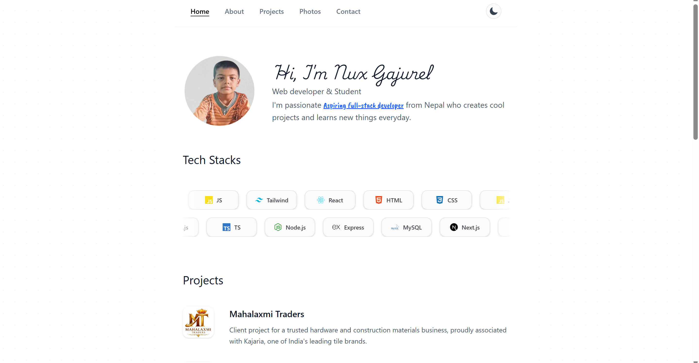
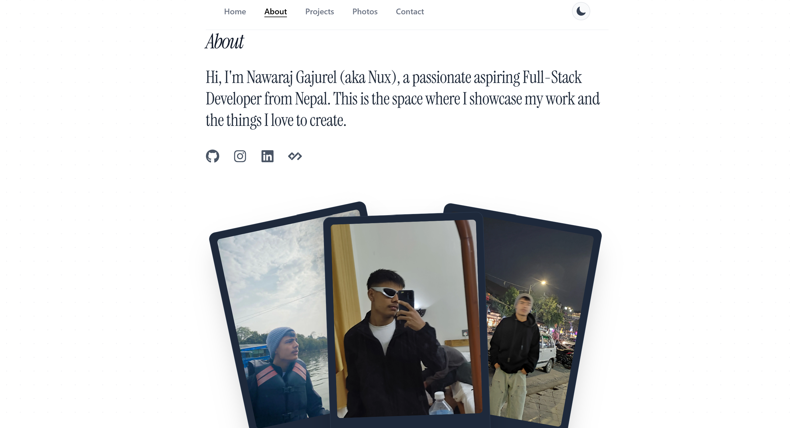
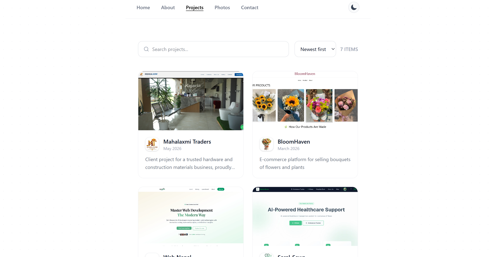

# Nux Gajurel — Portfolio

A modern, minimal personal portfolio built with Next.js and TypeScript. Showcasing projects, a photo gallery, a journey timeline, and a contact form powered by EmailJS.

---

## 📸 Screenshots

### Home Page


### About Page


### Projects Page


---

## 🛠️ Tech Stack

| Technology | Purpose |
|---|---|
| [Next.js 16](https://nextjs.org/) | React framework with App Router & Server Actions |
| [TypeScript](https://www.typescriptlang.org/) | Type-safe JavaScript |
| [Tailwind CSS v4](https://tailwindcss.com/) | Utility-first CSS styling |
| [Framer Motion](https://www.framer.com/motion/) | Animations & transitions |
| [EmailJS](https://www.emailjs.com/) | Contact form email sending (no backend required) |
| [React Icons](https://react-icons.github.io/react-icons/) | Icon library |
| [next-themes](https://github.com/pacocoursey/next-themes) | Dark / light mode support |
| [Google Fonts](https://fonts.google.com/) | Instrument Serif, Playwrite IE, Caveat Brush |

---

## ✨ Features

- **Home** — Intro, animated avatar, tech stack marquee, featured projects, photo gallery, and journey timeline
- **Projects** — Searchable and sortable project showcase with detail views
- **About** — Personal background and story
- **Photos** — Gallery of personal moments
- **Uses** — Gear and software setup
- **Contact** — Email form connected to EmailJS with success/error feedback
- **Dark Mode** — Full dark/light theme support

---

## 🚀 Getting Started

### Prerequisites

- Node.js `>= 18.x`
- npm or yarn

### Installation

```bash
# Install dependencies
npm install
```

### Development Server

```bash
npm run dev
```

Open [http://localhost:3000](http://localhost:3000) in your browser.

### Production Build

```bash
npm run build
npm run start
```

---

## 📧 EmailJS Setup (Contact Form)

The contact form sends emails via the [EmailJS REST API](https://www.emailjs.com/docs/rest-api/send/). No backend or SMTP server is required.

### 1. Create an EmailJS account

Go to [https://www.emailjs.com/](https://www.emailjs.com/) and sign up for a free account.

### 2. Set up a Service

In your EmailJS dashboard → **Email Services** → Add a new service (e.g., Gmail, Outlook).  
Copy the **Service ID**.

### 3. Create an Email Template

Go to **Email Templates** → Create a template.  
Use these template variables in your template body:

```
From: {{from_name}} <{{from_email}}>
Subject: {{subject}}

{{message}}
```

Copy the **Template ID**.

### 4. Get your Public Key

Go to **Account** → **API Keys** → copy your **Public Key**.  
Optionally, copy your **Private Key** too (required if you enable EmailJS security restrictions).

### 5. Configure Environment Variables

Create or update `.env.local` at the root of the project:

```env
EMAILJS_SERVICE_ID=your_emailjs_service_id
EMAILJS_TEMPLATE_ID=your_emailjs_template_id
EMAILJS_PUBLIC_KEY=your_emailjs_public_key
EMAILJS_PRIVATE_KEY=your_emailjs_private_key   # optional
```

> **Note:** Restart the dev server after updating `.env.local`.

---

## 📁 Project Structure

```
portfolio/
├── app/
│   ├── about/          # About page
│   ├── actions/        # Server actions (send-email.ts)
│   ├── api/            # API routes
│   ├── blogs/          # Blog section
│   ├── contact/        # Contact page
│   ├── photos/         # Photo gallery
│   ├── projects/       # Projects showcase
│   ├── uses/           # Uses / gear page
│   ├── globals.css     # Global styles
│   ├── layout.tsx      # Root layout
│   └── page.tsx        # Home page
├── components/
│   ├── footer.tsx
│   ├── journey.tsx     # Timeline journey section
│   ├── navbar.tsx
│   ├── tech-marquee.tsx
│   └── theme-provider.tsx
├── public/             # Static assets
├── .env.local          # Environment variables (not committed)
└── package.json
```

---

## 📄 License

MIT — feel free to use as inspiration for your own portfolio.
